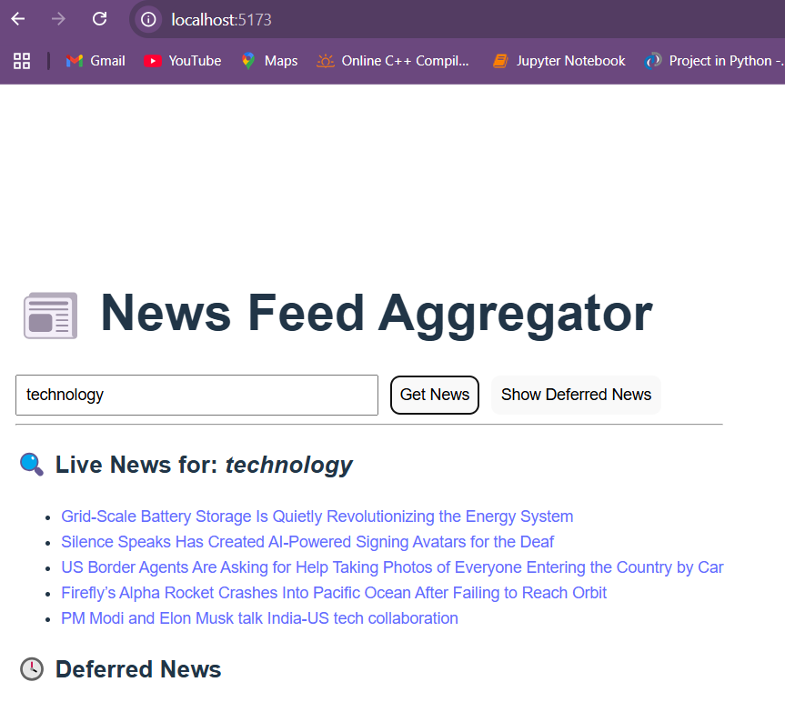
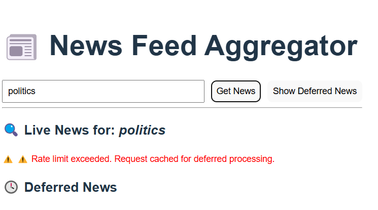
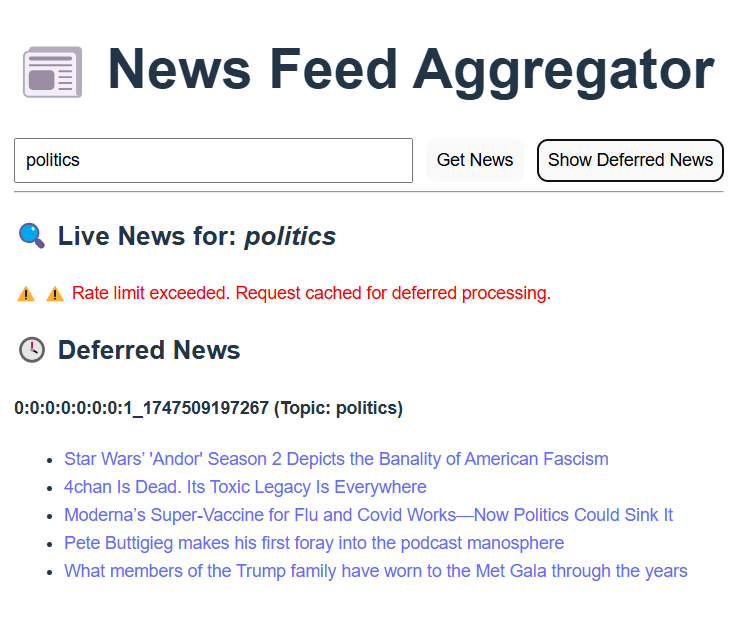

# 📰 News Feed Aggregator — React + Spring Boot

A full-stack web application that fetches and displays live news articles based on a user-provided topic, with built-in rate limiting and deferred request handling.

---

## ⚙️ How It Works

This application integrates with [NewsAPI.org](https://newsapi.org) to fetch real-time news based on a topic entered by the user.

### 🔄 Request Flow:
- ✅ Each user is allowed **up to 5 API requests per minute**.
- 🚧 If the user exceeds this limit:
  - The excess request is **cached** using Caffeine.
  - A background job runs every **60 seconds** to **process deferred requests** from the cache.
- 🪄 Processed results are displayed in the **Deferred News** section of the UI.

---

## 📌 Features

- 🔍 **Live News Fetching:** Users can search for real-time news by topic.
- 🚦 **Rate Limiting:** Automatically restricts users to 5 API calls/min.
- 💾 **Deferred Request Caching:** Queues extra requests for later processing.
- ⏳ **Scheduled Processing:** Executes every minute to handle overflow.
- ⚠️ **Frontend Feedback:** React UI provides real-time alerts and results.
- 🌈 **Modern UI:** Built with React (Vite + TypeScript).

---

## 🧰 Tech Stack

| Layer     | Tools & Libraries                          |
|-----------|---------------------------------------------|
| Frontend  | React (Vite, TypeScript), Fetch API         |
| Backend   | Spring Boot, Spring Cache, Bucket4j         |
| Caching   | Caffeine (in-memory), with optional Redis   |
| News API  | [NewsAPI.org](https://newsapi.org)          |
| Scheduler | Spring `@Scheduled` task                    |

---

## 📷 Screenshots

<h4>🔍 Live News Result</h4>

<h4>⚠️ Rate Limit Exceeded</h4>

<h4>🕓 Deferred News Result</h4>

---
